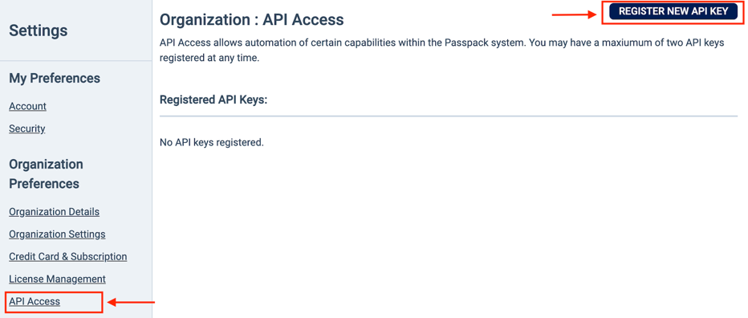
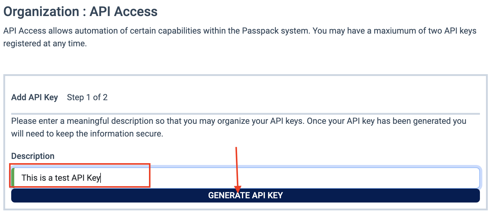
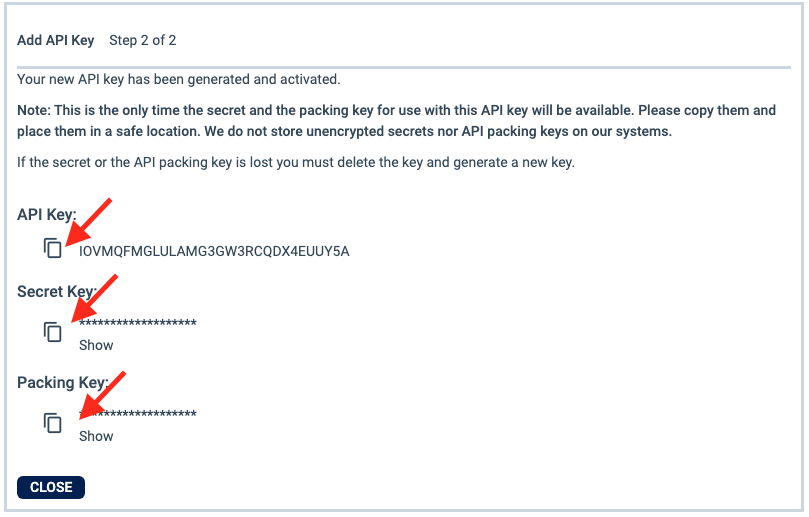

# Passpack SDK

---

The Passpack SDK is a collection of tools and libraries that allow developers to interact with the Passpack API. 

One of the most challenging aspects of integrating with Passpack is the utilization of several encryption schemes which are used in various data management scenarios. The SDK wraps the necessary encryption in easy to use functions and classes, allowing developers to focus on the business logic of their application.

> [!NOTE]
> The Passpack SDK is not considered "GA" and may be subject to breaking changes. Please use with caution.

## Features
The Passpack SDK provides the following features:

- **Key + Secret** for secure authentication with the Passpack API
  - Keys are created in the UI and may be revoked at any time
- **License Management**
    - Retrieve assigned licenses
    - Add new license to organization
- **Subscription Management**
    - Retrieve subscription details
- **User Management**
    - Invite new users
    - Cancel user invitations
    - Resend user invitations
    - Remove licensed user
    - Delete accounts<sup>1</sup> 
- **Team Management**
  - List teams 
  - Retrieve team details
  - Remove team member
  - Delete team
  
<sup>1</sup> These operations require a business tier subscription for the organization.

## Installation and Usage
The Passpack SDK is currently only available in the Java language, and it must be requested via the Passpack support team. The library is provided as a JAR file that can be included in your project.


### Installation
Install into your code base by adding the following into your maven `pom.xml` file:

```xml
<dependency>
  <groupId>com.passpack.api</groupId>
  <artifactId>java-api-sdk</artifactId>
  <version>${passpack.sdk.version}</version>
</dependency>
```

### Pre-requisites
- To obtain an API key you must be the organization owner
- You must have a valid Passpack account and current subscription
- Network access to the Passpack API
- Java 8 or higher

### Acquiring a Key
1. Navigate to the settings and Click on "API Access"
2. In the upper right corner, click on "Register New API Key".  You will be prompted to enter a description for the key.



3. Enter a meaningful description and click "Generate API Key". Once the button is clicked a key is generated for you.



4. You will need the key, secret, and packing key to interact with the API. You may either click on the copy icon or select the text and copy it to your clipboard. 

> [!NOTE]
> The secret is masked by asterisks.  If you do not click the copy icon, you must click the "Show" button to reveal the secret.

> [!WARNING]
> This is the only time you will be able to access the secret. Be sure to copy it down to a secure location.  If you misplace the secret you will need to delete the key and generate a new one.



### Using the SDK
Please contact customer support: support@passpack.com

## Acknowledgments

This project owes its existence to the open-source community's contributions and innovations. We are deeply grateful.

- **Project Lombok**: Their annotations vastly simplify our code. Visit them at [Project Lombok](https://projectlombok.org/).
- **FasterXML**: Their JSON processing annotations vastly simplify our code. Visit them at [FasterXML](https://github.com/FasterXML/jackson-databind/).
- **GSON**


---
